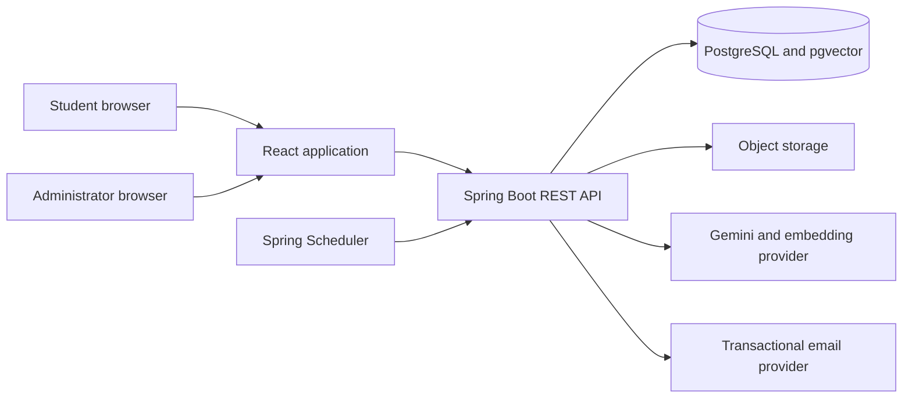

# System context

CareerPilot AI uses a modular-monolith architecture: one React client, one Spring Boot API, and one PostgreSQL database. Domain boundaries remain explicit so individual modules can be extracted later if operational scale warrants it.

## Backend boundaries

Future domain modules are `auth`, `profile`, `resume`, `job`, `skill`, `roadmap`, `assessment`, `exam`, `proctoring`, `evaluation`, `analytics`, `report`, `advisor`, `notification`, and `admin`.

Shared infrastructure belongs under `config`, `security`, `exception`, `validation`, `common`, and `integration`. Modules follow controller to service to repository layering and never expose persistence entities directly.

Phase 1 creates only cross-cutting foundation classes. Business-module packages will be introduced when their phases begin, avoiding empty placeholder types.

## Frontend boundaries

Frontend features will live under `src/features`, with shared UI, layouts, hooks, services, types, and routing kept separate. TanStack Query owns server state. Global client state is limited to session, theme, and short-lived exam concerns.

## Deployment

- Vercel serves the frontend.
- Render runs the stateless backend.
- Neon hosts PostgreSQL with pgvector.
- S3-compatible storage will hold durable resumes and generated reports.
- Secrets are injected by the deployment platform.

The backend must not rely on its local filesystem for durable data.

