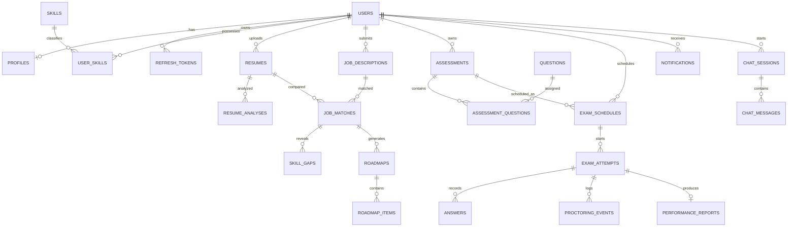
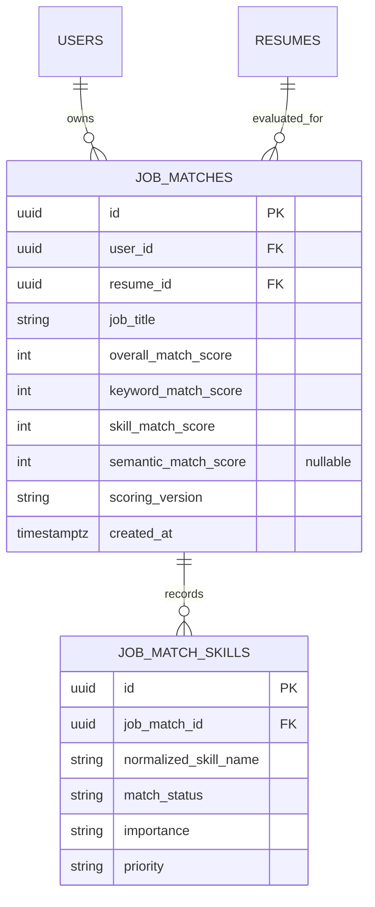

# Database model

Phase 1 creates only Flyway history, the pgvector extension, and a `schema_metadata` foundation table. The following target model guides later incremental migrations.

## Conventions

- UUID domain primary keys
- UTC `TIMESTAMPTZ` audit columns
- foreign keys and ownership indexes
- readable string status values with database checks where stable
- partial unique index for one active resume per user
- immutable/versioned analyses, assessments, attempts, and reports
- model and prompt-version metadata for AI-derived records
- vector columns only where semantic retrieval is required

Each future phase owns its Flyway migration. Hibernate remains in `validate` mode and never mutates production schemas.

## Phase 5 job matching

